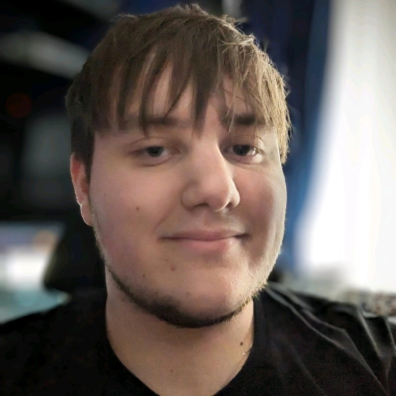

# Who am I?

{: style="width:35%; float:left; padding-right:20px;"}

I'm Kieran, an Apprentice Software Engineer based in Bridgend, South Wales. I've been working in the industry since I started my apprenticeship in 2022. I've always enjoyed STEM[^1] based subjects, originally wanting to become some kind of engineer. As I grew up and progressed through school, I took a natural liking towards computers and tech, and really enjoyed making *things*. I had a love for DIY and problem solving. This made me a natual fit to become a software engineer but most importantly, I really enjoy bashing my keyboard to make something cool!

I remember being introduced to a language called Scratch when I was in my early teens. My friends and I took a real big liking to Scratch, spending hours alongside school making weird and wonderful creations and sharing them with the Scratch community. I believe Scratch was primary reason I became so fond of software development. It just *scratched* :wink: an itch I didn't know I had.(1)
{ .annotate }

1. Scratch is a visual, high-level, block based programming language. You can find out more [here](https://scratch.mit.edu/).

If I'm not sat at a desk bashing away at a keyboard, you can find me spending time with family, playing videogames with friends *(it's a different kind of keyboard bashing, I swear!)* or playing bowls, *probably in the rain* :cloud_rain:.

[^1]: Science, Technology, Engineering and Maths